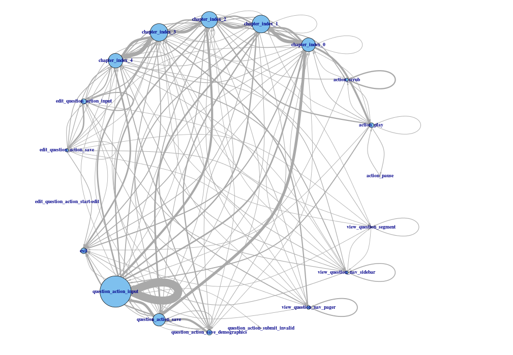

# graphpipe
```
                                 ,-.
                                ( o )_, ,-.
                                 `-`./\( o )
                                    /`.\/-'
        ,--.                        \=+'  ,--.
       /  /|                         O   /  /|
      /  / |                            /  / |
     ,--:  \                           .--:  |
     |  | ,-:                          |  |  |
     |  |( o-);-.                      |  |  |
     |  \ `-'/\_ \_O                 ,'/  |  |
     |   \  '\-\`--'__          __,-' /   |  |
     |    `.( o')     ``------''    ,'    |  |
     |      `:-'                  ,'      |  |
     |        `-.__          __,-'        | /
     |             ``------''             |/
     `------------------------------------'

```

When tracking user activity through a website, an easy way to capture the path of an individual's activity is by recording the order of every action and separating the list of all actions with pipes (`|`):
```
open|action1|action2|action3|action4|exit
```
Given a list of these pipe-delimited action paths for each user, `graphpipe` will split these paths apart and aggregate counts of all observed path-pairs, represented as an `R` `igraph` object:
```
paths = c("open|action1|action2|action3|action4|exit",
          "open|action1|exit",
          "open|action1|action2|action1|exit")
g = graphpipe(paths)
graphplot(g)

```
`graphplot` can accept some simple arguments to filter and style the resulting graph

```
graphplot(g,
          min_edge_weight = 2, # necessary number of links between nodes for inclusion
          edge_size = 20, # scale the edges
          vertex_size = 20, # scale verticies
          arrow_width = 0.5, # scale arrow width
          arrow_size = 0.25 # scale arrow size
          )
```
## Example:

## INSTALLATION
```
library("devtools")
install_github("abelsonlive", "graphpipe")
library("graphpipe")
```
